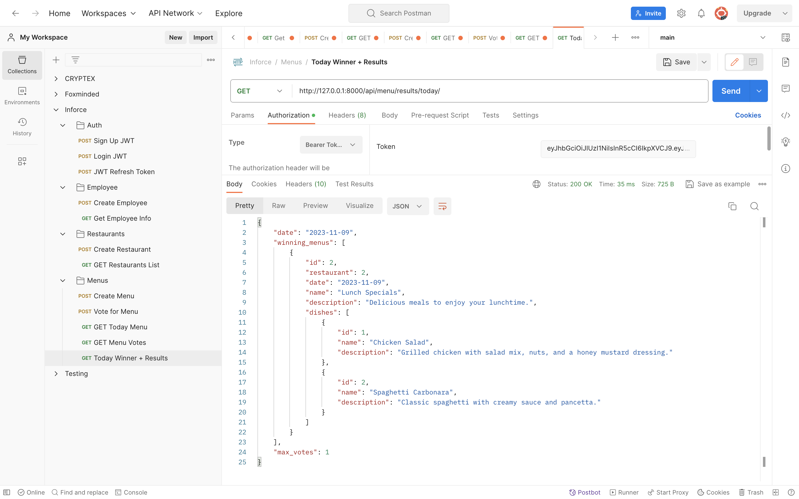

# Lunch Decision Service

Welcome to the Lunch Decision Service project! This backend service is designed to help employees of a company choose their lunch venue with an easy-to-use voting system. Each restaurant uploads their daily menu to the system, and employees cast their votes for their preferred choice before heading out for lunch.

## Features

- **User Authentication:** Securely manage user access with JWT authentication.
- **Restaurant Management:** Allows for creation and management of restaurant profiles.
- **Daily Menu Upload:** Restaurants can upload their daily menus which are accessible to all employees.
- **Employee Profile:** Employees can create and manage their profiles.
- **Voting System:** Employees can vote on their preferred menu for the day.
- **Live Results:** Real-time voting results show which menu is leading for the day.

## Built With

- [Django](https://www.djangoproject.com/) - A high-level Python Web framework that encourages rapid development and clean, pragmatic design.
- [Django REST Framework](https://www.django-rest-framework.org/) - A powerful and flexible toolkit for building Web APIs.
- [PostgreSQL](https://www.postgresql.org/) - A powerful, open-source object-relational database system.
- [JSON Web Tokens (JWT)](https://jwt.io/) - A compact URL-safe means of representing claims to be transferred between two parties.
- [Docker](https://www.docker.com/) - A set of platform as a service products that use OS-level virtualization to deliver software in packages called containers.
- [PyTest](https://pytest.org/) - A framework that makes it easy to write simple tests, yet scales to support complex functional testing.
- [Flake8](https://flake8.pycqa.org/en/latest/) - A tool for style guide enforcement.
<hr>

## Note that All the ``REST API's`` have been tested in ``Postman``:


## Quick Start

Follow these instructions to get your development environment up and running.

### Prerequisites

Make sure you have Python 3.9 or later, pip, and PostgreSQL installed on your machine. Optionally, you can manage the application in a Dockerized environment; ensure Docker is installed if you choose to go this route.

### Setting Up the Project

Clone the repository:

```shell
git clone https://github.com/yourusername/lunch_decision_service.git
```
```shell 
cd lunch_decision_service
```

Install dependencies:
```shell
pip install -r requirements.txt
```

Database Configuration
Create a PostgreSQL database and user for the project (refer to the PostgreSQL documentation for detailed instructions).

<hr>

## Running Migrations
### Make and apply database migrations:

```shell
python manage.py makemigrations
python manage.py migrate
```
## Create a Superuser
### Create an admin account for the project:
```shell
python manage.py createsuperuser
```

## Run server:
```shell
python manage.py runserver
```

### To run autopep8 on a file:
```shell
autopep8 --in-place --aggressive --aggressive <filename>
```
